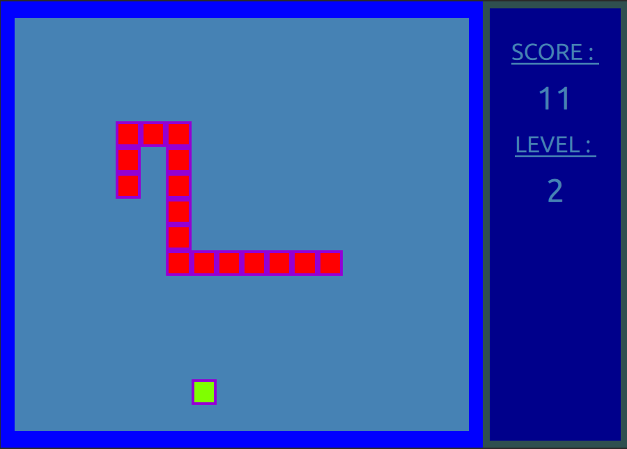

🐍 The Snake — Qt / QML
About: Classic Snake game built with Qt Quick (QML) and JavaScript. Early educational project showcasing real-time game logic, keyboard input handling, and UI–logic separation.

A classic Snake game implemented using Qt Quick (QML) and JavaScript.
This project represents one of my earliest hands-on experiences with Qt/QML, created very early in my learning journey.

🎮 Gameplay Overview
    • Control the snake using arrow keys
    • Eat food to grow longer and increase your score
    • Every 10 points, the game speed increases
    • The snake wraps around screen edges
    • The game ends when the snake collides with itself
Controls
    • ⬅️ ⬆️ ⬇️ ➡️ — Move
    • P — Pause / Resume
    • Space — Restart after game over

🧩 Main Components
QML UI
    • Game window, layout, and visual styling
    • Board rendering using Rectangle, Repeater, and ListModel
    • Keyboard input handling (Keys.onPressed)
    • HUD (score, level, pause/game over overlays)
JavaScript Backend
    • Game grid coordinate generation
    • Snake movement and direction logic
    • Collision detection (food & self-collision)
    • Dynamic food placement
    • Snake growth and level progression
    • Centralized game state handling
C++ Entry Point
    • Minimal Qt application bootstrap
    • Loads QML via QQmlApplicationEngine
    • No gameplay logic implemented in C++

🛠️ Technologies
    • Qt 5 / Qt Quick
    • QML
    • JavaScript (logic layer)
    • CMake
    • Qt Resource System (QRC)

⚠️ Project Status — Early Learning Project (MVP)
This project is a finished MVP and is not under active development.
    • Created exclusively for educational and portfolio purposes
    • Implemented without AI assistance
    • Written approximately 3 months after starting to learn Qt/QML
    • Architecture and coding style intentionally reflect an early learning stage
Some aspects that were deliberately out of scope at the time:
    • Advanced architecture patterns (e.g. MVVM)
    • Engine-level optimizations
    • Comprehensive edge-case handling
Despite this, the project demonstrates:
    • Practical Qt Quick usage
    • Clear UI–logic separation (QML + JS)
    • Non-trivial interaction and state management
    • Ability to design and finish a complete playable game

📌 About This Repository
This repository is kept public as a learning artifact — a snapshot of real progress made early in my Qt/QML journey.
It intentionally shows:
    • how my understanding of Qt evolved over time,
    • how I approached problems before learning more advanced patterns,
    • and how I translated ideas into working software at an early stage.
I strongly believe that sharing early projects like this provides valuable context for understanding long-term growth as a developer.

